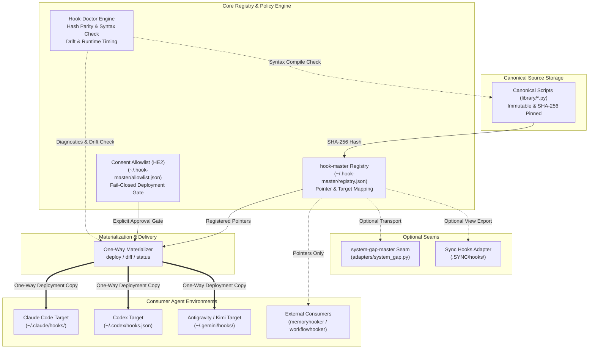
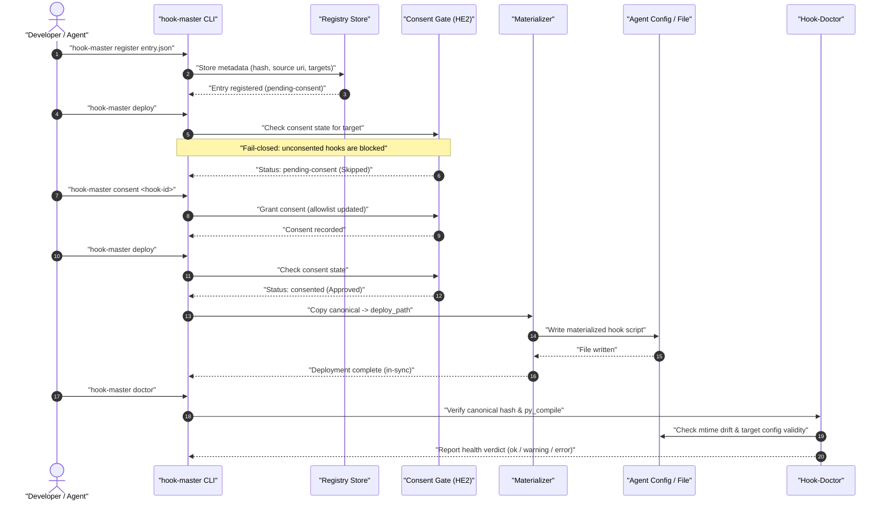

<!-- alternate banner: assets/banner-b.png (swap on occasion) -->

[](tests/) [](CHANGELOG.md) [](https://python.org) [](https://github.com/ellmos-ai/hook-master) [](SECURITY.md) [](SECURITY.md) [](SECURITY.md) [](NOTICE) [](https://github.com/astral-sh/ruff) [](https://github.com/ellmos-ai) [](https://github.com/open-bricks) [](llms.txt) [](llms.txt) [](SECURITY.md)

# hook-master

**Languages:** [English](README.md) · [Deutsch](README_de.md)

> [!NOTE]
> This repository ships an [`llms.txt`](llms.txt) discovery file for AI agents and LLMs.

Local-first pointer registry and one-way materialization for agent hooks (Claude Code, Codex, Kimi, Antigravity, ...). Built as an architectural sibling to [`policy-registry`](https://github.com/ellmos-ai/policy-registry) — sharing the same pointer-only registry mechanic and optional `system-gap-master` transport while operating 100% standalone without network access. Because hooks are **executable code** rather than static text, `hook-master` adds an explicit, fail-closed `deploy`/`diff`/`status` materialization pipeline and a diagnostics doctor engine.

---

## Quick Navigation

1. [Overview & Core Identity](#sec-01)
2. [Target Personas & High-Intent SEO Queries](#sec-02)
3. [Comparative Matrix vs. Alternatives](#sec-03)
4. [Governance & Runtime Invariants Matrix](#sec-04)
5. [Visual Architecture Topology](#sec-05)
6. [End-to-End Execution & Lifecycle Sequence](#sec-06)
7. [Quick Start & Common Workflows](#sec-07)
8. [Entry Model & Pointer Specifications](#sec-08)
9. [CLI Command Reference](#sec-09)
10. [Hook-Doctor Diagnostic Engine](#sec-10)
11. [First-Use Consent Gate & Allowlist (HE2)](#sec-11)
12. [Optional Transport & Adapters](#sec-12)
13. [Sibling Tools & Ecosystem Matrix](#sec-13)
14. [Security Policy & Vulnerability SLAs](#sec-14)
15. [Machine-Readable LLM Context](#sec-15)
16. [Testing, Verification & Quality Gates](#sec-16)
17. [Third-Party Licenses & Level 1 SBOM](#sec-17)
18. [Statutory Notice, Liability Limitation & License (§ 521 BGB)](#sec-18)

---

<a id="sec-01"></a><a id="1-overview--core-identity"></a><a id="overview--why"></a><a id="overview"></a>
## 1. Overview & Core Identity

A hook registered in one agent's configuration can silently depend on a file that lives in a *different* agent's private directory. Prior to `hook-master`, Codex's `~/.codex/hooks.json` pointed its `PreToolUse` guard straight at `C:/Users/<user>/.claude/hooks/guards.py` — a private Claude-Code path Codex has no business depending on directly.

`hook-master` fixes this coupling across all agent runtimes:
1. **Canonical Home (`library/`):** Hook scripts live in a single canonical repository, pinned by SHA-256 digests.
2. **Pointer Registry:** Knows every target agent consuming each hook and their target config files.
3. **One-Way Materialization:** Copies canonical scripts to wherever each agent's configuration expects them (`canonical → deployed`, never reverse).
4. **First-Use Consent Gate:** Blocks unconsented hook materialization by default (fail-closed security).
5. **Doctor Engine:** Detects hash mismatches, syntax errors (`py_compile`), target config invalidity, and mtime drift.

---

<a id="sec-02"></a><a id="2-target-personas--discoverability"></a><a id="target-personas--high-intent-seo-queries"></a><a id="personas"></a>
## 2. Target Personas & High-Intent SEO Queries

`hook-master` is specifically architected to serve four distinct developer and operator personas:

### `[PERSONA-01]` Autonomous AI Agent & Multi-Node Swarm Architects
- **Profile:** Engineers orchestrating multi-agent systems across Claude Code, OpenAI Codex, Antigravity, Kimi, and local Ollama runtimes.
- **High-Intent Search Queries:** `agent hook management`, `multi agent hook registry`, `claude code hooks json isolation`, `cross-agent hook synchronization`.
- **How `hook-master` Solves It:** Eliminates brittle cross-agent path references by establishing a unified metadata registry and deterministic deployment pipeline.

### `[PERSONA-02]` Local-First, Zero-Egress & Air-Gapped Tool Builders
- **Profile:** Developers creating offline-capable developer tools and privacy-first automation environments.
- **High-Intent Search Queries:** `offline agent hook registry`, `zero-egress hook deployer`, `local-first script materialization`, `no network agent guard`.
- **How `hook-master` Solves It:** 100% offline execution with zero network sockets, zero telemetry, and zero third-party runtime dependencies.

### `[PERSONA-03]` Multi-Agent Infrastructure & DevOps Engineers
- **Profile:** Platform engineers responsible for workstations, developer fleet configuration parity, and preventing silent script drift.
- **High-Intent Search Queries:** `agent hook drift detection`, `fail-closed hook allowlist`, `prevent hook tampering`, `agent script integrity check`.
- **How `hook-master` Solves It:** The `hook-doctor` engine detects file modification time anomalies, syntax errors, and cryptographic hash divergence.

### `[PERSONA-04]` Enterprise Safety, Governance & Compliance Officers
- **Profile:** Compliance auditors and enterprise security officers requiring verifiable execution controls and clear supply-chain provenance.
- **High-Intent Search Queries:** `agent hook security consent gate`, `RunAsInvoker agent hooks`, `level 1 sbom hook manager`, `audited agent tooling`.
- **How `hook-master` Solves It:** Enforces an explicit first-use consent allowlist (`allowlist.json`), unprivileged user-mode execution, and Level 1 SBOM transparency.

---

<a id="sec-03"></a><a id="3-comparative-matrix-vs-alternatives"></a><a id="comparative-matrix"></a>
## 3. Comparative Matrix vs. Alternatives

The following matrix compares `hook-master` against four common industry alternatives across ten critical architectural and governance dimensions:

| Invariant / Feature | Ad-Hoc Config Edits | Cross-Directory Symlinks | Generic Shell / Git Hooks | Heavy Daemon / Webhooks | `hook-master` (Our Solution) |
|:---|:---:|:---:|:---:|:---:|:---:|
| **`INV-LOCAL-01` 100% Local-First & Zero Egress** | Partial | Yes | Yes | No (requires network) | **PASS (100% Offline)** |
| **`INV-SEC-02` Unprivileged User Execution** | Yes | No (requires admin on Win) | Yes | No (service elevation) | **PASS (`RunAsInvoker`)** |
| **`INV-PTR-03` Pointer-Only Registry** | No (inline bodies) | No (raw symlinks) | No | No (opaque database) | **PASS (Pointers Only)** |
| **`INV-EXEC-04` Executable Trust Class Separation** | No | No | No | Partial | **PASS (Cryptographic SHA-256)** |
| **`INV-MAT-05` One-Way Materialization** | No (bidirectional chaos) | No (two-way mutation) | No | Partial | **PASS (Canonical -> Deployed)** |
| **`INV-CONSENT-06` Fail-Closed Consent Gate** | No | No | No | Complex RBAC | **PASS (`allowlist.json` Gate)** |
| **`INV-DOC-07` Deep Doctor Diagnostics** | None | None (silent breakage) | Manual | Telemetry Heavy | **PASS (AST, Hash, Drift)** |
| **`INV-TRANS-08` Optional Transport Independence** | N/A | N/A | N/A | Hard Network Lock-in | **PASS (Decoupled Adapters)** |
| **`INV-LIC-09` Zero Copyleft Dependency Footprint** | N/A | N/A | N/A | Heavy Dependencies | **PASS (Zero Runtime Deps, MIT)** |
| **`INV-SLA-10` Contractual 48h Security SLA** | None | None | None | Commercial Only | **PASS (Binding 48h SLA)** |

---

<a id="sec-04"></a><a id="4-governance--runtime-invariants-matrix"></a><a id="governance-invariants"></a>
## 4. Governance & Runtime Invariants Matrix

`hook-master` enforces ten immutable design invariants that govern its execution, storage, and lifecycle:

| Invariant Code | Name | Architectural Commitment | Verification Mechanism |
|:---|:---|:---|:---|
| `INV-LOCAL-01` | 100% Local-First & Zero-Egress | Operates entirely on the local filesystem without network sockets or telemetry. | Zero network imports, verified by test suite. |
| `INV-SEC-02` | Unprivileged Execution | Executes under standard user permissions (`RunAsInvoker`) without administrative elevation. | Safe filesystem permissions, non-elevated tests. |
| `INV-PTR-03` | Pointer-Only Registry | `registry.json` stores file paths, target mappings, and hashes — never script bodies. | `model.py` rejects script body fields. |
| `INV-EXEC-04` | Executable Trust Class Separation | Treats hooks as executable code requiring cryptographic hash verification. | SHA-256 digest validation on every check. |
| `INV-MAT-05` | One-Way Materialization | Copies canonical source to deployed targets; never allows targets to overwrite canonical. | Directional materialization in `materialize.py`. |
| `INV-CONSENT-06` | Fail-Closed Consent Gate | Unconsented hook scripts cannot be deployed until explicitly approved in `allowlist.json`. | Fail-closed gate in `consent.py`. |
| `INV-DOC-07` | Deep Doctor Diagnostics | Validates canonical files, syntax executability (`py_compile`), and config integrity. | `doctor.py` diagnostic engine with exit codes. |
| `INV-TRANS-08` | Optional Transport Independence | Functions fully standalone; `system-gap-master` is purely an optional transport adapter. | Graceful `ImportError` handling in adapters. |
| `INV-LIC-09` | Permissive Licensing Footprint | 100% MIT and Python Software Foundation license stack; zero copyleft contamination. | Audited Level 1 SBOM in `THIRD_PARTY_LICENSES.md`. |
| `INV-SLA-10` | 48h Security Response SLA | Public commitment to confirm security reports within 48h and complete triage in 5 days. | Published SLA in `SECURITY.md` and README. |

---

<a id="sec-05"></a><a id="5-visual-architecture-topology"></a><a id="system-architecture"></a>
## 5. Visual Architecture Topology



---

<a id="sec-06"></a><a id="6-end-to-end-execution--lifecycle-sequence"></a><a id="execution--lifecycle-flow"></a>
## 6. End-to-End Execution & Lifecycle Sequence



---

<a id="sec-07"></a><a id="7-quick-start--common-workflows"></a><a id="quick-start"></a>
## 7. Quick Start & Common Workflows

```bash
# 1. Install in editable mode
pip install -e .

# 2. Initialize default registry (~/.hook-master/registry.json)
hook-master init

# 3. Register a hook definition
hook-master register my-hook.json

# 4. Verify canonical file hashes against registry
hook-master verify

# 5. Review consent status & grant deployment consent
hook-master consent-status
hook-master consent my-hook-id

# 6. Deploy canonical scripts to registered target paths
hook-master deploy

# 7. Check deployment status and drift
hook-master diff
hook-master status

# 8. Run deep system diagnostics
hook-master doctor --timing
```

---

<a id="sec-08"></a><a id="8-entry-model--pointer-specifications"></a><a id="entry-model"></a>
## 8. Entry Model & Pointer Specifications

Every registry entry is metadata only — never executable script text (`model.py` rejects `content`/`body`/`script_text` fields outright). Two distinct kinds:

- **`kind: "hook"`** — a concrete script. `source.kind: "canonical"` means the script lives in this module (`source.uri` + `source.hash`, SHA-256). Each `targets[]` entry names an `agent`, its `config_path`, and (for canonical hooks) a `deploy_path` — the materialized copy's location.
- **`kind: "consumer"`** — a registered *module* that owns its own hook registration logic entirely (currently: `memoryhooker`, `workflowhooker`, both via `source.kind: "external-module"`). `hook-master` catalogues that it exists and which agents/events it covers; it never re-implements or wraps the consumer's own logic.

There is also a reserved, still-unevaluated optional `doctor` object per entry (`exec_check`, `mtime_policy`, `allowlist`) — schema-validated for shape but not read by anything. **Do not confuse it with the actual Hook-Doctor + Consent-Allowlist feature ("HE2"), which ships in this release and lives entirely outside that field** — see the next sections.

---

<a id="sec-09"></a><a id="9-cli-command-reference"></a><a id="cli-commands"></a>
## 9. CLI Command Reference

| Command | Effect |
|---|---|
| `init` | Create an empty registry at the default (or `--registry`) path |
| `register <entry.json>` | Add or replace one metadata entry |
| `list` / `get <id>` / `search [query]` | Query and inspect the registry |
| `verify` | Hash-check every canonical entry's source file |
| `deploy [--id <id>] [--dry-run]` | Copy canonical → deploy_path for matching consented entries |
| `diff [--id <id>]` | Read-only: report in-sync / drifted / not-deployed without writes |
| `status` | `verify` + `diff` combined reporting |
| `import-sync --root <dir> --slot <slot>` | One-time migration: pull `kind=consumer` pointers from `.SYNC/hooks/adoption/<slot>.json` |
| `export-sync-view --root <dir> --slot <slot>` | Optional: publish a metadata-only view into `.SYNC/hooks/registry/<slot>.json` |
| `doctor [--id <id>] [--timing]` | Comprehensive diagnostics beyond verify/diff (checks hashes, syntax, drift, configs). Exit `0`/`1`/`2` |
| `consent <id> [--by <name>] [--note <text>]` | Grant deploy consent for one entry |
| `consent-status [<id>]` | Display consent state for one or all entries |

---

<a id="sec-10"></a><a id="10-hook-doctor-diagnostic-engine"></a><a id="hook-doctor"></a>
## 10. Hook-Doctor Diagnostic Engine

Concept rebuild after the Hermes-Agent pattern (`hermes doctor`-style diagnostics + first-use consent allowlist), not a code takeover — see `T-20260825-152496601`.

**`hook-master doctor [--id <id>] [--timing]`** goes beyond `verify`/`diff`:
- For every `kind=hook` entry: verifies canonical-file existence, SHA-256 hash integrity, syntax executability (`py_compile` for `.py` sources), materialization state, and mtime drift (detecting direct edits to deployed copies that bypass canonical source).
- For every target: validates that referenced agent configuration files (`settings.json`, `hooks.json`, `config.toml`) exist and parse cleanly.
- `kind=consumer` entries (`memoryhooker`, `workflowhooker`) receive configuration parsing checks.
- Exit severity: `0` (ok), `1` (warning), `2` (error). `--timing` benchmarks `py_compile` compilation duration.

---

<a id="sec-11"></a><a id="11-first-use-consent-gate--allowlist-he2"></a><a id="consent-allowlist"></a>
## 11. First-Use Consent Gate & Allowlist (HE2)

Stored at `~/.hook-master/allowlist.json` (or via `HOOK_MASTER_ALLOWLIST_PATH`):
- A newly registered `kind=hook` entry is **not** materialized by `deploy()` until explicitly consented; it reports `pending-consent` and is left untouched.
- **Fail-Open Read:** Missing or unparseable allowlist degrades gracefully to "nothing consented" without crashing the CLI.
- **Fail-Closed Gate:** Deploy decisions treat any unconsented entry as strictly forbidden.
- Grandfathered entries from the initial release are seeded as `consented_by: "grandfathered"` with full auditability.

---

<a id="sec-12"></a><a id="12-optional-transport--adapters"></a><a id="optional-transport-never-required"></a>
## 12. Optional Transport & Adapters

`adapters/system_gap.py` only activates if `system_gap_master` is importable. The registry — and every command above — works fully offline and standalone without it, adhering to architectural decision D-20260728-001 ("system-gap-master is only an optional transport adapter"). A single-machine setup with no `.SYNC` folder at all is a fully supported configuration, not a degraded one.

---

<a id="sec-13"></a><a id="13-sibling-tools--ecosystem-matrix"></a><a id="sibling-tools--ecosystem"></a>
## 13. Sibling Tools & Ecosystem Matrix

`hook-master` integrates cleanly with the broader `ellmos-ai` and `open-bricks` architecture:

| Repository | Role & Architectural Scope | Organization |
|---|---|---|
| [`policy-registry`](https://github.com/ellmos-ai/policy-registry) | Architectural sibling — pointer-only registry for rules and policies | `ellmos-ai` |
| [`memoryhooker`](https://github.com/ellmos-ai/memoryhooker) | Registered consumer — long-term memory capture and retrieval hooks | `ellmos-ai` |
| [`workflowhooker`](https://github.com/ellmos-ai/workflowhooker) | Registered consumer — pipeline interception and workflow lifecycle hooks | `ellmos-ai` |
| [`system-gap-master`](https://github.com/ellmos-ai/system-gap-master) | Optional transport — multi-agent system diagnostics & gap auditing | `ellmos-ai` |
| [`source-resolver`](https://github.com/ellmos-ai/source-resolver) | Role-to-provider routing & capability resolution engine | `ellmos-ai` |
| [`lock-master`](https://github.com/ellmos-ai/lock-master) | Centralized concurrency locks and multi-agent coordination | `ellmos-ai` |
| [`ticket-master`](https://github.com/ellmos-ai/ticket-master) | Ticket tracking and inter-agent task handoff protocol | `ellmos-ai` |
| [`DevCenter`](https://github.com/dev-bricks/DevCenter) | Developer workspace & centralized tooling launcher | `dev-bricks` |
| [`CodeBox`](https://github.com/dev-bricks/CodeBox) | Isolated sandbox execution environment for agent scripts | `dev-bricks` |
| [`open-bricks`](https://github.com/open-bricks) | Umbrella organization coordinating open-source modules | `open-bricks` |

---

<a id="sec-14"></a><a id="14-security-policy--vulnerability-slas"></a><a id="security"></a>
## 14. Security Policy & Vulnerability SLAs

Security is an architectural pillar of `hook-master`:
- **Zero-Egress & Local-First:** Operates strictly within local process and filesystem boundaries.
- **Unprivileged User-Mode (`RunAsInvoker`):** Never requires or requests administrative elevation.
- **Fail-Closed Consent Gate:** Ensures no hook script is deployed without explicit user consent.
- **Cryptographic Pointers:** Every hook is pinned by its SHA-256 hash.
- **Contractual Vulnerability SLAs:** Binding commitments to acknowledge vulnerability reports within **48 hours** and provide triage assessments within **5 business days** via `security@open-bricks.org` and `security@ellmos.ai`. See [SECURITY.md](SECURITY.md) for full policy details.

---

<a id="sec-15"></a><a id="15-machine-readable-llm-context"></a><a id="llms-txt"></a>
## 15. Machine-Readable LLM Context

This repository provides a standardized [`llms.txt`](llms.txt) file at the repository root. Automated agents, LLM toolchains, and RAG pipelines can consume this index to understand CLI syntax, architectural constraints, key file locations, and security boundaries without ingesting unnecessary repository bloat.

---

<a id="sec-16"></a><a id="16-testing-verification--quality-gates"></a><a id="testing"></a>
## 16. Testing, Verification & Quality Gates

The test suite validates both functional execution and architectural contracts:

```bash
# Run full contract and unit test suite
pytest

# Enforce strict code formatting and linting
ruff check .

# Validate bytecode compilation
python -m compileall -q src tests

# Verify git whitespace hygiene
git diff --check
```

---

<a id="sec-17"></a><a id="17-third-party-licenses--level-1-sbom"></a><a id="third-party-licenses"></a>
## 17. Third-Party Licenses & Level 1 SBOM

`hook-master` maintains a complete Level 1 Software Bill of Materials (SBOM) in [`THIRD_PARTY_LICENSES.md`](THIRD_PARTY_LICENSES.md).
- **Core Runtime:** 100% Python Standard Library ([PSFL-2.0](https://docs.python.org/3/license.html)), zero external runtime packages.
- **Optional Adapters:** Permissive MIT-licensed integrations.
- **Zero Copyleft:** Strictly zero GPL, AGPL, or restrictive copyleft dependencies.
- **Formal Attribution:** See [`NOTICE`](NOTICE) for copyright and organizational provenance.

---

<a id="sec-18"></a><a id="18-statutory-notice-liability-limitation--license--521-bgb"></a><a id="statutory-notice-liability-limitation--license--521-bgb"></a><a id="license"></a><a id="lizenz"></a><a id="-license"></a><a id="-lizenz"></a>
## 18. Statutory Notice, Liability Limitation & License (§ 521 BGB)

### Open Source License
This software is licensed under the terms of the [MIT License](LICENSE).
Formal ecosystem attribution and origin notices are declared in [`NOTICE`](NOTICE).
Detailed Level 1 SBOM and dependency transparency records are available in [`THIRD_PARTY_LICENSES.md`](THIRD_PARTY_LICENSES.md).

### German Statutory Notice & Liability Limitation (§ 521 BGB Gefälligkeitsrecht)
The provision of this software and its associated documentation is gratuitous (unentgeltliche Bereitstellung). In accordance with the statutory liability regime under German Civil Law governing gratuitous services (**§ 521 BGB** — *Haftung des Schenkers*), liability for any defects of quality or title (Sach- und Rechtsmängel) is strictly limited to cases of intentional misconduct (**Vorsatz**) and gross negligence (**grobe Fahrlässigkeit**). Any broader statutory warranty or tortious liability for slight negligence is expressly excluded to the fullest extent permitted by applicable law.
