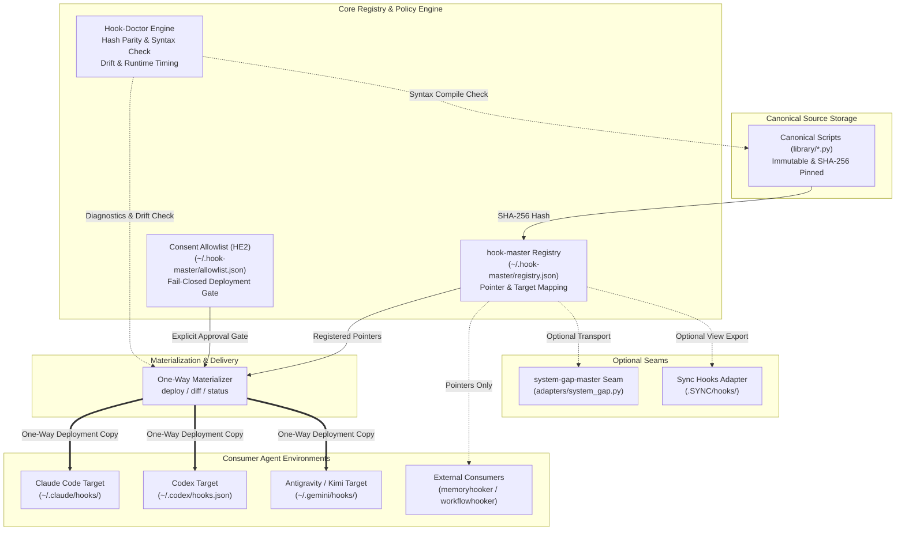
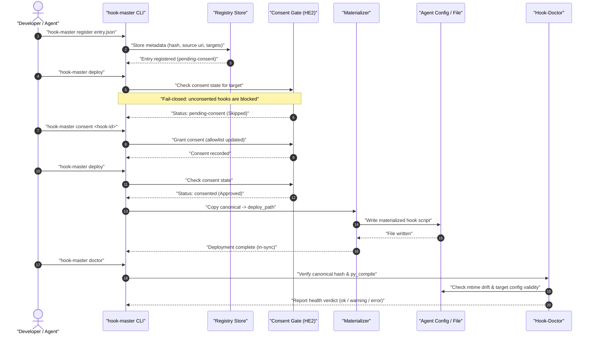

<!-- alternate banner: assets/banner-b.png (swap on occasion) -->

[](tests/) [](CHANGELOG.md) [](https://python.org) [](https://github.com/ellmos-ai/hook-master) [](SECURITY.md) [](SECURITY.md) [](SECURITY.md) [](https://github.com/astral-sh/ruff) [](https://github.com/ellmos-ai) [](https://github.com/open-bricks) [](llms.txt)

# hook-master

**Languages:** [English](README.md) · [Deutsch](README_de.md)

> [!NOTE]
> This repository ships an [`llms.txt`](llms.txt) discovery file for AI agents and LLMs.

Local-first pointer registry and one-way materialization for agent hooks (Claude Code, Codex, Kimi, Antigravity, ...). Built as an architectural sibling to [`policy-registry`](https://github.com/ellmos-ai/policy-registry) — sharing the same pointer-only registry mechanic and optional `system-gap-master` transport while operating 100% standalone without network access. Because hooks are **executable code** rather than static text, `hook-master` adds an explicit, fail-closed `deploy`/`diff`/`status` materialization pipeline and a diagnostics doctor engine.

---

## Table of Contents

- [Overview & Why](#overview--why)
- [System Architecture](#system-architecture)
- [Execution & Lifecycle Flow](#execution--lifecycle-flow)
- [Quick Start](#quick-start)
- [Entry Model](#entry-model)
- [CLI Commands](#cli-commands)
- [Hook-Doctor & First-Use Consent (HE2)](#hook-doctor--first-use-consent-he2)
- [Optional Transport, Never Required](#optional-transport-never-required)
- [Sibling Tools & Ecosystem](#sibling-tools--ecosystem)
- [Security Architecture](#security)
- [License](#license)

---

## Overview & Why

A hook registered in one agent's configuration can silently depend on a file that lives in a *different* agent's private directory. Prior to `hook-master`, Codex's `~/.codex/hooks.json` pointed its `PreToolUse` guard straight at `C:/Users/<user>/.claude/hooks/guards.py` — a private Claude-Code path Codex has no business depending on directly.

`hook-master` fixes this coupling across all agent runtimes:
1. **Canonical Home (`library/`):** Hook scripts live in a single canonical repository, pinned by SHA-256 digests.
2. **Pointer Registry:** Knows every target agent consuming each hook and their target config files.
3. **One-Way Materialization:** Copies canonical scripts to wherever each agent's configuration expects them (`canonical → deployed`, never reverse).
4. **First-Use Consent Gate:** Blocks unconsented hook materialization by default (fail-closed security).
5. **Doctor Engine:** Detects hash mismatches, syntax errors (`py_compile`), target config invalidity, and mtime drift.

---

## System Architecture



---

## Execution & Lifecycle Flow



---

## Quick Start

```bash
# 1. Install in editable mode
pip install -e .

# 2. Initialize default registry (~/.hook-master/registry.json)
hook-master init

# 3. Register a hook definition
hook-master register my-hook.json

# 4. Verify canonical file hashes against registry
hook-master verify

# 5. Review consent status & grant deployment consent
hook-master consent-status
hook-master consent my-hook-id

# 6. Deploy canonical scripts to registered target paths
hook-master deploy

# 7. Check deployment status and drift
hook-master diff
hook-master status

# 8. Run deep system diagnostics
hook-master doctor --timing
```

---

## Entry Model

Every registry entry is metadata only — never executable script text (`model.py` rejects `content`/`body`/`script_text` fields outright). Two distinct kinds:

- **`kind: "hook"`** — a concrete script. `source.kind: "canonical"` means the script lives in this module (`source.uri` + `source.hash`, SHA-256). Each `targets[]` entry names an `agent`, its `config_path`, and (for canonical hooks) a `deploy_path` — the materialized copy's location.
- **`kind: "consumer"`** — a registered *module* that owns its own hook registration logic entirely (currently: `memoryhooker`, `workflowhooker`, both via `source.kind: "external-module"`). `hook-master` catalogues that it exists and which agents/events it covers; it never re-implements or wraps the consumer's own logic.

There is also a reserved, still-unevaluated optional `doctor` object per entry (`exec_check`, `mtime_policy`, `allowlist`) — schema-validated for shape but not read by anything. **Do not confuse it with the actual Hook-Doctor + Consent-Allowlist feature ("HE2"), which ships in this release and lives entirely outside that field** — see the next section.

---

## CLI Commands

| Command | Effect |
|---|---|
| `init` | Create an empty registry at the default (or `--registry`) path |
| `register <entry.json>` | Add or replace one metadata entry |
| `list` / `get <id>` / `search [query]` | Query and inspect the registry |
| `verify` | Hash-check every canonical entry's source file |
| `deploy [--id <id>] [--dry-run]` | Copy canonical → deploy_path for matching consented entries |
| `diff [--id <id>]` | Read-only: report in-sync / drifted / not-deployed without writes |
| `status` | `verify` + `diff` combined reporting |
| `import-sync --root <dir> --slot <slot>` | One-time migration: pull `kind=consumer` pointers from `.SYNC/hooks/adoption/<slot>.json` |
| `export-sync-view --root <dir> --slot <slot>` | Optional: publish a metadata-only view into `.SYNC/hooks/registry/<slot>.json` |
| `doctor [--id <id>] [--timing]` | Comprehensive diagnostics beyond verify/diff (checks hashes, syntax, drift, configs). Exit `0`/`1`/`2` |
| `consent <id> [--by <name>] [--note <text>]` | Grant deploy consent for one entry |
| `consent-status [<id>]` | Display consent state for one or all entries |

---

## Hook-Doctor & First-Use Consent (HE2)

Concept rebuild after the Hermes-Agent pattern (`hermes doctor`-style diagnostics + first-use consent allowlist), not a code takeover — see `T-20260825-152496601`.

### `hook-master doctor`

**`hook-master doctor [--id <id>] [--timing]`** goes beyond `verify`/`diff`:
- For every `kind=hook` entry: verifies canonical-file existence, SHA-256 hash integrity, syntax executability (`py_compile` for `.py` sources), materialization state, and mtime drift (detecting direct edits to deployed copies that bypass canonical source).
- For every target: validates that referenced agent configuration files (`settings.json`, `hooks.json`, `config.toml`) exist and parse cleanly.
- `kind=consumer` entries (`memoryhooker`, `workflowhooker`) receive configuration parsing checks.
- Exit severity: `0` (ok), `1` (warning), `2` (error). `--timing` benchmarks `py_compile` compilation duration.

### Consent Allowlist

Stored at `~/.hook-master/allowlist.json` (or via `HOOK_MASTER_ALLOWLIST_PATH`):
- A newly registered `kind=hook` entry is **not** materialized by `deploy()` until explicitly consented; it reports `pending-consent` and is left untouched.
- **Fail-Open Read:** Missing or unparseable allowlist degrades gracefully to "nothing consented" without crashing the CLI.
- **Fail-Closed Gate:** Deploy decisions treat any unconsented entry as strictly forbidden.
- Grandfathered entries from the initial release are seeded as `consented_by: "grandfathered"` with full auditability.

---

## Optional Transport, Never Required

`adapters/system_gap.py` only activates if `system_gap_master` is importable. The registry — and every command above — works fully offline and standalone without it, adhering to architectural decision D-20260728-001 ("system-gap-master is only an optional transport adapter"). A single-machine setup with no `.SYNC` folder at all is a fully supported configuration, not a degraded one.

---

## Sibling Tools & Ecosystem

`hook-master` integrates cleanly with the broader `ellmos-ai` and `open-bricks` architecture:

| Repository | Role & Architectural Scope | Organization |
|---|---|---|
| [`policy-registry`](https://github.com/ellmos-ai/policy-registry) | Architectural sibling — pointer-only registry for rules and policies | `ellmos-ai` |
| [`memoryhooker`](https://github.com/ellmos-ai/memoryhooker) | Registered consumer — long-term memory capture and retrieval hooks | `ellmos-ai` |
| [`workflowhooker`](https://github.com/ellmos-ai/workflowhooker) | Registered consumer — pipeline interception and workflow lifecycle hooks | `ellmos-ai` |
| [`system-gap-master`](https://github.com/ellmos-ai/system-gap-master) | Optional transport — multi-agent system diagnostics & gap auditing | `ellmos-ai` |
| [`source-resolver`](https://github.com/ellmos-ai/source-resolver) | Role-to-provider routing & capability resolution engine | `ellmos-ai` |
| [`lock-master`](https://github.com/ellmos-ai/lock-master) | Centralized concurrency locks and multi-agent coordination | `ellmos-ai` |
| [`ticket-master`](https://github.com/ellmos-ai/ticket-master) | Ticket tracking and inter-agent task handoff protocol | `ellmos-ai` |
| [`DevCenter`](https://github.com/dev-bricks/DevCenter) | Developer workspace & centralized tooling launcher | `dev-bricks` |
| [`CodeBox`](https://github.com/dev-bricks/CodeBox) | Isolated sandbox execution environment for agent scripts | `dev-bricks` |
| [`open-bricks`](https://github.com/open-bricks) | Umbrella organization coordinating open-source modules | `open-bricks` |

---

## Security

See [SECURITY.md](SECURITY.md) — local-first, zero-egress, pointer-only registry (never script text), one-way materialization, non-elevation.

---

## License

MIT — see [LICENSE](LICENSE).
