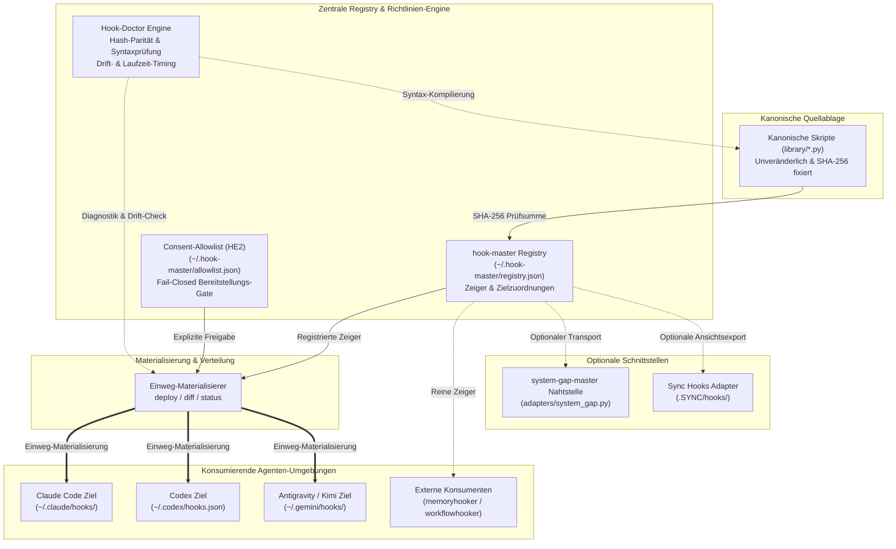
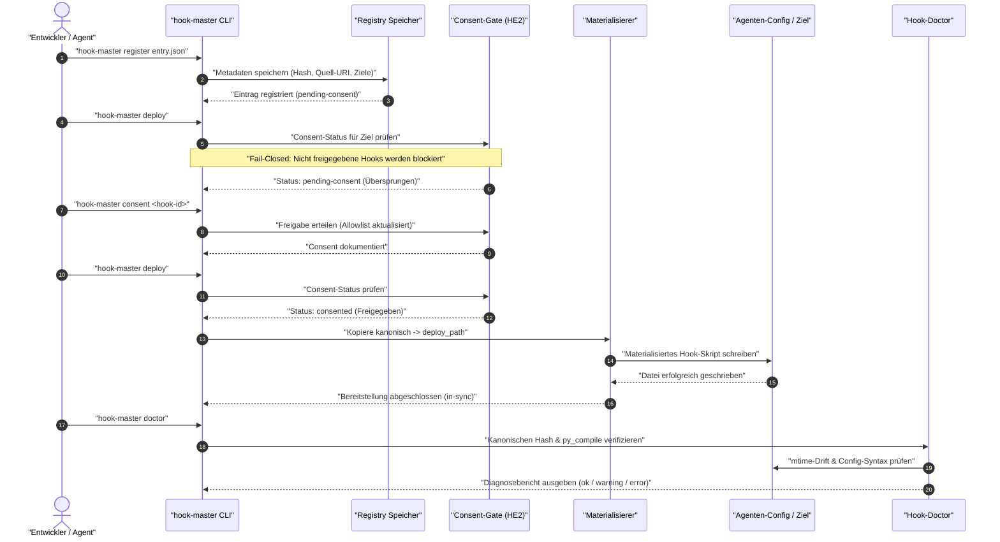

[](tests/) [](CHANGELOG.md) [](https://python.org) [](https://github.com/ellmos-ai/hook-master) [](SECURITY.md) [](SECURITY.md) [](SECURITY.md) [](https://github.com/astral-sh/ruff) [](https://github.com/ellmos-ai) [](https://github.com/open-bricks) [](llms.txt)

# hook-master

**Sprachen:** [English](README.md) · [Deutsch](README_de.md)

> [!NOTE]
> Dieses Repository liefert eine [`llms.txt`](llms.txt)-Discovery-Datei für KI-Agenten und LLMs.

Lokale, pointer-basierte Registry mit deterministischer Einweg-Materialisierung für Agenten-Hooks (Claude Code, Codex, Kimi, Antigravity, ...). Gebaut als architektonisches Schwestermodul zu [`policy-registry`](https://github.com/ellmos-ai/policy-registry) — dieselbe Mechanik (reine Zeiger-Registry, optionaler `system-gap-master`-Transport, 100% offline- und netzwerkfrei lauffähig). Weil Hooks **ausführbarer Code** statt statischer Richtlinientexte sind, bringt `hook-master` eine explizite Fail-Closed `deploy`/`diff`/`status`-Materialisierungspipeline und ein tiefgreifendes Doctor-Diagnosesystem mit.

---

## Inhaltsverzeichnis

- [Überblick & Motivation](#überblick--motivation)
- [Systemarchitektur](#systemarchitektur)
- [Ausführungs- & Lifecycle-Ablauf](#ausführungs--lifecycle-ablauf)
- [Schnellstart](#schnellstart)
- [Eintragsmodell](#eintragsmodell)
- [CLI-Befehle](#cli-befehle)
- [Hook-Doctor & Erstnutzungs-Consent (HE2)](#hook-doctor--erstnutzungs-consent-he2)
- [Optionaler Transport, nie erforderlich](#optionaler-transport-nie-erforderlich)
- [Geschwisterwerkzeuge & Ökosystem](#geschwisterwerkzeuge--ökosystem)
- [Sicherheitsarchitektur](#sicherheit)
- [Lizenz](#lizenz)

---

## Überblick & Motivation

Ein in der Konfiguration eines Agenten registrierter Hook kann still von einer Datei abhängen, die im **privaten** Verzeichnis eines ANDEREN Agenten liegt. Vor der Einführung dieses Moduls zeigte Codex' `~/.codex/hooks.json` seinen `PreToolUse`-Guard direkt auf `C:/Users/<user>/.claude/hooks/guards.py` — einen internen Pfad von Claude Code, den Codex nicht direkt referenzieren sollte.

`hook-master` löst diese Kopplung agentenübergreifend auf:
1. **Kanonischer Quellort (`library/`):** Hook-Skripte leben in einer zentralen kanonischen Quellbibliothek, per SHA-256-Prüfsumme unveränderlich fixiert.
2. **Zeiger-Registry:** Kennt jeden konsumierenden Zielagenten und dessen erwartete Pfade.
3. **Einweg-Materialisierung:** Kopiert kanonische Skripte deterministisch an die Zielorte der Agenten-Konfigurationen (`kanonisch → materialisiert`, niemals umgekehrt).
4. **Erstnutzungs-Consent Gate:** Blockiert unautorisierte Hook-Materialisierungen standardmäßig (Fail-Closed-Sicherheit).
5. **Doctor-Diagnose:** Überprüft Hash-Integrität, Syntaxkompilierung (`py_compile`), Konfigurationsgültigkeit und mtime-Drift.

---

## Systemarchitektur



---

## Ausführungs- & Lifecycle-Ablauf



---

## Schnellstart

```bash
# 1. Im Entwicklungsmodus installieren
pip install -e .

# 2. Standard-Registry initialisieren (~/.hook-master/registry.json)
hook-master init

# 3. Hook-Definition registrieren
hook-master register my-hook.json

# 4. Hash der kanonischen Dateien gegen Registry verifizieren
hook-master verify

# 5. Consent-Status einsehen & Freigabe erteilen
hook-master consent-status
hook-master consent my-hook-id

# 6. Kanonische Skripte an registrierte Zielpfade ausrollen
hook-master deploy

# 7. Bereitstellungszustand und Drift prüfen
hook-master diff
hook-master status

# 8. Tiefendiagnose ausführen
hook-master doctor --timing
```

---

## Eintragsmodell

Jeder Registry-Eintrag ist reine Metadatensache — nie Skript-Text (`model.py` weist `content`/`body`/`script_text`-Felder strikt zurück). Zwei Arten:

- **`kind: "hook"`** — ein konkretes Skript. `source.kind: "canonical"` bedeutet, das Skript lebt in diesem Modul (`source.uri` + `source.hash`, SHA-256). Jeder `targets[]`-Eintrag nennt einen `agent`, dessen `config_path` und (bei kanonischen Hooks) einen `deploy_path` — den Ort der materialisierten Kopie.
- **`kind: "consumer"`** — ein registriertes *Modul*, das seine eigene Hook-Registrierungslogik vollständig selbst besitzt (aktuell: `memoryhooker`, `workflowhooker`, beide über `source.kind: "external-module"`). `hook-master` katalogisiert nur, dass es existiert und welche Agenten/Events es abdeckt — es reimplementiert oder umhüllt die eigene Logik des Konsumenten nie.

Daneben gibt es ein reserviertes, weiterhin unausgewertetes optionales `doctor`-Objekt je Eintrag (`exec_check`, `mtime_policy`, `allowlist`) — nur auf Form geprüft, von nichts gelesen. **Nicht verwechseln mit der tatsächlichen Hook-Doctor- + Consent-Allowlist-Funktion ("HE2"), die in diesem Release ausgeliefert wird und vollständig außerhalb dieses Feldes lebt** — siehe nächster Abschnitt.

---

## CLI-Befehle

| Befehl | Wirkung |
|---|---|
| `init` | Leere Registry am Standard- (oder `--registry`-) Pfad anlegen |
| `register <entry.json>` | Einen Metadateneintrag hinzufügen oder ersetzen |
| `list` / `get <id>` / `search [query]` | Registry abfragen und durchsuchen |
| `verify` | Hash-Check jedes kanonischen Eintrags gegen seine Quelldatei |
| `deploy [--id <id>] [--dry-run]` | Kanonisch → deploy_path für passende, freigegebene Einträge kopieren |
| `diff [--id <id>]` | Nur lesend: in-sync / drifted / not-deployed melden, keine Schreibvorgänge |
| `status` | `verify` + `diff` kombiniert ausgeben |
| `import-sync --root <dir> --slot <slot>` | Einmalige Migration: `kind=consumer`-Zeiger aus bestehender `.SYNC/hooks/adoption/<slot>.json`-Struktur übernehmen |
| `export-sync-view --root <dir> --slot <slot>` | Optional: reine Metadaten-Ansicht nach `.SYNC/hooks/registry/<slot>.json` veröffentlichen |
| `doctor [--id <id>] [--timing]` | Diagnose über verify/diff hinaus (prüft Hashes, Syntax, Drift, Konfigurationen). Exit `0`/`1`/`2` |
| `consent <id> [--by <name>] [--note <text>]` | Deploy-Freigabe für einen Eintrag erteilen |
| `consent-status [<id>]` | Consent-Status für einen oder alle Einträge anzeigen |

---

## Hook-Doctor & Erstnutzungs-Consent (HE2)

Konzept-Nachbau nach dem Hermes-Agent-Muster (`hermes doctor`-artige Diagnose + Erstnutzungs-Consent-Allowlist), keine Code-Übernahme — siehe `T-20260825-152496601`.

### `hook-master doctor`

**`hook-master doctor [--id <id>] [--timing]`** geht über `verify`/`diff` hinaus:
- Für jeden `kind=hook`-Eintrag werden Existenz und SHA-256-Hash der kanonischen Datei, Ausführbarkeit (`py_compile` für `.py`-Quellen), Materialisierungszustand und mtime-Drift geprüft (materialisierte Kopie direkt bearbeitet, kanonischer Weg umgangen).
- Für jedes Ziel wird zusätzlich geprüft, ob die referenzierte Agent-Config-Datei (`settings.json`/`hooks.json`/`config.toml`) existiert und sich fehlerfrei parsen lässt.
- `kind=consumer`-Einträge (`memoryhooker`, `workflowhooker`) erhalten vollständige Konfigurationsprüfungen.
- Schweregrad ist `ok` < `warning` < `error`; Exit-Code entsprechend `0`/`1`/`2`. `--timing` ergänzt eine präzise `py_compile`-Zeitmessung je kanonischem Skript.

### Consent-Allowlist

Gespeichert unter `~/.hook-master/allowlist.json` (oder via `HOOK_MASTER_ALLOWLIST_PATH`):
- Ein brandneuer `kind=hook`-Eintrag wird von `deploy()` **nicht** materialisiert, bevor er explizit freigegeben wurde — er wird als `pending-consent` gemeldet und unangetastet gelassen.
- **Fail-Open Lesen:** Eine fehlende oder unlesbare Datei wirft nie eine Exception, sondern degradiert sicher zu „nichts freigegeben", ohne die CLI zum Absturz zu bringen.
- **Fail-Closed Deploy:** Unbekannte oder nicht freigegebene Einträge werden ausnahmslos blockiert.
- Großvater-Einträge aus dem ersten Release wurden mit `consented_by: "grandfathered"` auditierbar initialisiert.

---

## Optionaler Transport, nie erforderlich

`adapters/system_gap.py` aktiviert sich nur, wenn `system_gap_master` importierbar ist. Die Registry — und jeder Befehl oben — funktioniert vollständig offline und eigenständig auch ohne dieses Paket, genau wie bei `policy-registry` (D-20260728-001: „system-gap-master ist nur ein optionaler Transportadapter"). Ein Ein-System-Setup ganz ohne `.SYNC`-Ordner ist eine vollständig unterstützte Konfiguration, keine degradierte.

---

## Geschwisterwerkzeuge & Ökosystem

`hook-master` gliedert sich nahtlos in die Architektur von `ellmos-ai` und `open-bricks` ein:

| Repository | Rolle & Architektonischer Fokus | Organisation |
|---|---|---|
| [`policy-registry`](https://github.com/ellmos-ai/policy-registry) | Architektonisches Schwestermodul — Zeiger-Registry für Regeln & Richtlinien | `ellmos-ai` |
| [`memoryhooker`](https://github.com/ellmos-ai/memoryhooker) | Registrierter Konsument — Hooks für Langzeitgedächtnis und Kontext-Injektion | `ellmos-ai` |
| [`workflowhooker`](https://github.com/ellmos-ai/workflowhooker) | Registrierter Konsument — Lifecycle- und Interzeptions-Hooks für Workflows | `ellmos-ai` |
| [`system-gap-master`](https://github.com/ellmos-ai/system-gap-master) | Optionaler Transport — Systemdiagnostik und Lücken-Auditing | `ellmos-ai` |
| [`source-resolver`](https://github.com/ellmos-ai/source-resolver) | Rollen-zu-Anbieter-Auflösung & Orchestrierungs-Engine | `ellmos-ai` |
| [`lock-master`](https://github.com/ellmos-ai/lock-master) | Zentrales Lock-System für Multi-Agenten-Koordination | `ellmos-ai` |
| [`ticket-master`](https://github.com/ellmos-ai/ticket-master) | Ticket-Tracking und strukturierte Agenten-Übergabeprotokolle | `ellmos-ai` |
| [`DevCenter`](https://github.com/dev-bricks/DevCenter) | Entwickler-Arbeitsplatz & zentralisierter Tooling-Launcher | `dev-bricks` |
| [`CodeBox`](https://github.com/dev-bricks/CodeBox) | Isolierte Sandbox-Ausführung für agentengenerierten Code | `dev-bricks` |
| [`open-bricks`](https://github.com/open-bricks) | Dachorganisation zur Koordinierung offener Entwicklungsmodule | `open-bricks` |

---

## Sicherheit

Siehe [SECURITY.md](SECURITY.md) — local-first, Zero-Egress, reine Zeiger-Registry (nie Skript-Text), Einweg-Materialisierung, Non-Elevation.

---

## Lizenz

MIT — siehe [LICENSE](LICENSE).
