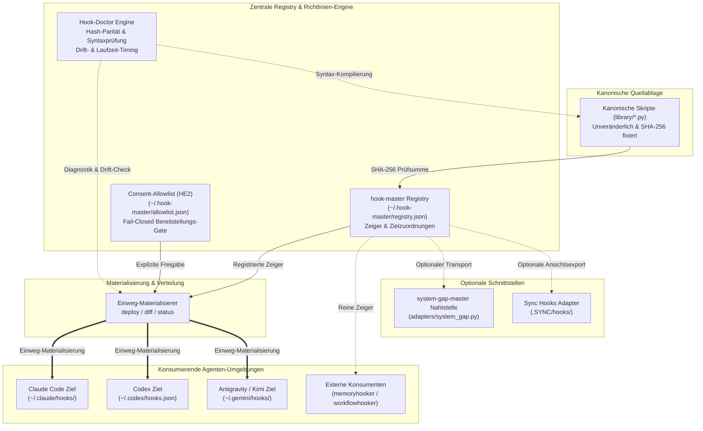
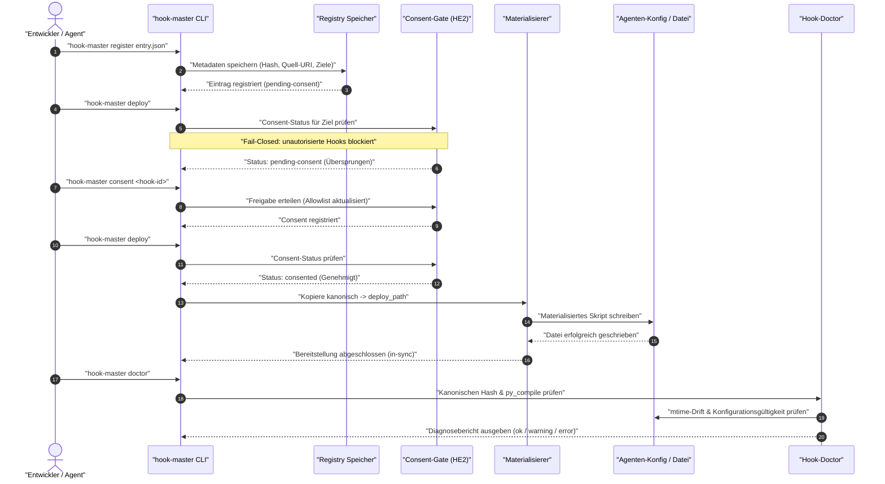

<!-- alternate banner: assets/banner-b.png (swap on occasion) -->

[](tests/) [](CHANGELOG.md) [](https://python.org) [](https://github.com/ellmos-ai/hook-master) [](SECURITY.md) [](SECURITY.md) [](SECURITY.md) [](NOTICE) [](https://github.com/astral-sh/ruff) [](https://github.com/ellmos-ai) [](https://github.com/open-bricks) [](llms.txt) [](llms.txt) [](SECURITY.md)

# hook-master

**Sprachen:** [English](README.md) · [Deutsch](README_de.md)

> [!NOTE]
> Dieses Repository liefert eine [`llms.txt`](llms.txt)-Discovery-Datei für KI-Agenten und LLMs.

Lokale, pointer-basierte Registry mit deterministischer Einweg-Materialisierung für Agenten-Hooks (Claude Code, Codex, Kimi, Antigravity, ...). Gebaut als architektonisches Schwestermodul zu [`policy-registry`](https://github.com/ellmos-ai/policy-registry) — dieselbe Mechanik (reine Zeiger-Registry, optionaler `system-gap-master`-Transport, 100% offline- und netzwerkfrei lauffähig). Weil Hooks **ausführbarer Code** statt statischer Richtlinientexte sind, bringt `hook-master` eine explizite Fail-Closed `deploy`/`diff`/`status`-Materialisierungspipeline und ein tiefgreifendes Doctor-Diagnosesystem mit.

---

## Schnellnavigation

1. [Überblick & Kernidentität](#sec-01)
2. [Zielgruppen & Auffindbarkeit](#sec-02)
3. [Vergleichsmatrix gegenüber Alternativen](#sec-03)
4. [Governance- & Laufzeit-Invarianten-Matrix](#sec-04)
5. [Visuelle Architektur-Topologie](#sec-05)
6. [Ausführungs- & Lifecycle-Ablauf](#sec-06)
7. [Schnellstart & typische Workflows](#sec-07)
8. [Eintragsmodell & Zeiger-Spezifikationen](#sec-08)
9. [CLI-Befehlsreferenz](#sec-09)
10. [Hook-Doctor Diagnose-Engine](#sec-10)
11. [Erstnutzungs-Consent Gate & Allowlist (HE2)](#sec-11)
12. [Optionaler Transport & Adapter](#sec-12)
13. [Geschwisterwerkzeuge & Ökosystem-Matrix](#sec-13)
14. [Sicherheitsrichtlinie & Vulnerability-SLAs](#sec-14)
15. [Maschinenlesbarer LLM-Kontext](#sec-15)
16. [Tests, Verifikation & Quality-Gates](#sec-16)
17. [Drittanbieter-Lizenzen & Level 1 SBOM](#sec-17)
18. [Gesetzlicher Hinweis, Haftungsbeschränkung & Lizenz (§ 521 BGB)](#sec-18)

---

<a id="sec-01"></a><a id="1-ueberblick--kernidentitaet"></a><a id="ueberblick--motivation"></a><a id="ueberblick"></a>
## 1. Überblick & Kernidentität

Ein in der Konfiguration eines Agenten registrierter Hook kann still von einer Datei abhängen, die im **privaten** Verzeichnis eines ANDEREN Agenten liegt. Vor der Einführung dieses Moduls zeigte Codex' `~/.codex/hooks.json` seinen `PreToolUse`-Guard direkt auf `C:/Users/<user>/.claude/hooks/guards.py` — einen internen Pfad von Claude Code, den Codex nicht direkt referenzieren sollte.

`hook-master` löst diese Kopplung agentenübergreifend auf:
1. **Kanonischer Quellort (`library/`):** Hook-Skripte leben in einer zentralen kanonischen Quellbibliothek, per SHA-256-Prüfsumme unveränderlich fixiert.
2. **Zeiger-Registry:** Kennt jeden konsumierenden Zielagenten und dessen erwartete Pfade.
3. **Einweg-Materialisierung:** Kopiert kanonische Skripte deterministisch an die Zielorte der Agenten-Konfigurationen (`kanonisch → materialisiert`, niemals umgekehrt).
4. **Erstnutzungs-Consent Gate:** Blockiert unautorisierte Hook-Materialisierungen standardmäßig (Fail-Closed-Sicherheit).
5. **Doctor-Diagnose:** Überprüft Hash-Integrität, Syntaxkompilierung (`py_compile`), Konfigurationsgültigkeit und mtime-Drift.

---

<a id="sec-02"></a><a id="2-zielgruppen--auffindbarkeit"></a><a id="ziel-personas--high-intent-seo-suchanfragen"></a><a id="personas"></a>
## 2. Zielgruppen & Auffindbarkeit

`hook-master` ist gezielt für vier Entwickler- und Betreiber-Zielgruppen entworfen:

### `[PERSONA-01]` Autonome KI-Agenten- & Multi-Node-Schwarm-Architekten
- **Profil:** Ingenieure, die Multi-Agenten-Systeme über Claude Code, OpenAI Codex, Antigravity, Kimi und lokale Ollama-Instanzen koordinieren.
- **Suchintention & SEO-Begriffe:** `agent hook management`, `multi agent hook registry`, `claude code hooks json isolation`, `cross-agent hook synchronization`.
- **Lösung durch `hook-master`:** Beseitigt fragile pfadbasierte Kopplungen zwischen Agenten über eine zentrale Registry und deterministische Bereitstellung.

### `[PERSONA-02]` Local-First, Zero-Egress & Air-Gapped Tool-Entwickler
- **Profil:** Entwickler, die offlinefähige Entwicklerwerkzeuge und strikte, datenschutzkonforme Automationsumgebungen bauen.
- **Suchintention & SEO-Begriffe:** `offline agent hook registry`, `zero-egress hook deployer`, `local-first script materialization`, `no network agent guard`.
- **Lösung durch `hook-master`:** 100% Offline-Ausführung ohne Netzwerk-Sockets, ohne Telemetrie und ohne externe Laufzeit-Abhängigkeiten.

### `[PERSONA-03]` Multi-Agenten-Infrastruktur- & DevOps-Ingenieure
- **Profil:** Plattform-Teams, die Entwickler-Workstations und Flottenparität verwalten und stillen Skript-Drift unterbinden wollen.
- **Suchintention & SEO-Begriffe:** `agent hook drift detection`, `fail-closed hook allowlist`, `prevent hook tampering`, `agent script integrity check`.
- **Lösung durch `hook-master`:** Die `hook-doctor`-Engine erkennt Modifikationszeit-Anomalien, Syntaxfehler und kryptografische Hash-Abweichungen.

### `[PERSONA-04]` Enterprise-Sicherheits-, Governance- & Compliance-Beauftragte
- **Profil:** Sicherheitsauditoren und IT-Compliance-Beauftragte, die kontrollierte Ausführungspfade und Lieferketten-Transparenz nachweisen müssen.
- **Suchintention & SEO-Begriffe:** `agent hook security consent gate`, `RunAsInvoker agent hooks`, `level 1 sbom hook manager`, `audited agent tooling`.
- **Lösung durch `hook-master`:** Erzwingt eine explizite Erstnutzungs-Allowlist (`allowlist.json`), unprivilegierte Benutzerrechte (`RunAsInvoker`) und Level 1 SBOM-Transparenz.

---

<a id="sec-03"></a><a id="3-vergleichsmatrix-gegenueber-alternativen"></a><a id="vergleichsmatrix"></a>
## 3. Vergleichsmatrix gegenüber Alternativen

Die folgende Matrix vergleicht `hook-master` mit vier verbreiteten Ansätzen anhand von zehn zentralen Architektur- und Governance-Dimensionen:

| Invariante / Merkmal | Ad-Hoc Konfig-Edits | Verzeichnisübergreifende Symlinks | Generische Shell- / Git-Hooks | Schwere Daemons / Webhooks | `hook-master` (Unsere Lösung) |
|:---|:---:|:---:|:---:|:---:|:---:|
| **`INV-LOCAL-01` 100% Local-First & Zero-Egress** | Teilweise | Ja | Ja | Nein (benötigt Netzwerk) | **ERFÜLLT (100% Offline)** |
| **`INV-SEC-02` Unprivilegierte Ausführung** | Ja | Nein (Admin auf Windows nötig) | Ja | Nein (Dienst-Privilegien) | **ERFÜLLT (`RunAsInvoker`)** |
| **`INV-PTR-03` Reine Zeiger-Registry** | Nein (eingebetteter Code) | Nein (rohe Links) | Nein | Nein (opake Datenbank) | **ERFÜLLT (Nur Zeiger)** |
| **`INV-EXEC-04` Vertrauensklassen-Trennung** | Nein | Nein | Nein | Teilweise | **ERFÜLLT (SHA-256 Hashes)** |
| **`INV-MAT-05` Deterministische Einweg-Bereitstellung** | Nein (wechselseitiges Chaos) | Nein (beidseitige Mutation) | Nein | Teilweise | **ERFÜLLT (Kanonisch -> Ziel)** |
| **`INV-CONSENT-06` Fail-Closed Freigabe-Gate** | Nein | Nein | Nein | Komplexes RBAC | **ERFÜLLT (`allowlist.json` Gate)** |
| **`INV-DOC-07` Umfassende Doctor-Diagnostik** | Keine | Keine (stille Defekte) | Manuell | Sehr telemetrielastig | **ERFÜLLT (AST, Hash, Drift)** |
| **`INV-TRANS-08` Optionale Transport-Entkopplung** | Nicht zutreffend | Nicht zutreffend | Nicht zutreffend | Harte Bindung | **ERFÜLLT (Entkoppelte Adapter)** |
| **`INV-LIC-09` Keine Copyleft-Abhängigkeiten** | Nicht zutreffend | Nicht zutreffend | Nicht zutreffend | Großer Abhängigkeitsbaum | **ERFÜLLT (0 Laufzeitdeps, MIT)** |
| **`INV-SLA-10` Verbindliche 48h Sicherheits-SLA** | Keine | Keine | Keine | Nur kommerziell | **ERFÜLLT (Verbindliche SLA)** |

---

<a id="sec-04"></a><a id="4-governance--laufzeit-invarianten-matrix"></a><a id="governance-invarianten"></a>
## 4. Governance- & Laufzeit-Invarianten-Matrix

`hook-master` setzt zehn unveränderliche Entwurfs-Invarianten durch, die Ausführung, Persistenz und Lebenszyklus steuern:

| Invarianten-Code | Name | Architektonische Zusage | Prüf- & Durchsetzungsmechanismus |
|:---|:---|:---|:---|
| `INV-LOCAL-01` | 100% Local-First & Zero-Egress | Arbeitet vollständig auf dem lokalen Dateisystem ohne Netzwerk-Sockets oder Telemetrie. | Keine Netzwerkimporte, durch Testsuite garantiert. |
| `INV-SEC-02` | Unprivilegierte Ausführung | Läuft unter Standardbenutzerrechten (`RunAsInvoker`) ohne administrative Rechteerweiterung. | Sichere Dateirechte, nicht-privilegierte Tests. |
| `INV-PTR-03` | Reine Zeiger-Registry | `registry.json` speichert Pfade, Zielzuordnungen und Hashes — niemals Skriptinhalte. | `model.py` weist Skriptinhaltsfelder strikt ab. |
| `INV-EXEC-04` | Ausführbare Vertrauensklasse | Behandelt Hooks als ausführbaren Code mit kryptografischer SHA-256-Integritätsprüfung. | SHA-256-Verifikation bei jedem Prüflauf. |
| `INV-MAT-05` | Einweg-Materialisierung | Kopiert kanonische Quellen an Zielorte; verhindert Rücküberschreibung kanonischer Dateien. | Einweg-Logik in `materialize.py`. |
| `INV-CONSENT-06` | Fail-Closed Freigabe-Gate | Unautorisierte Hooks werden nicht bereitgestellt, solange keine Genehmigung in `allowlist.json` vorliegt. | Fail-Closed Gate in `consent.py`. |
| `INV-DOC-07` | Umfassende Doctor-Diagnose | Validiert Quellexistenz, Syntaxkompilierung (`py_compile`) und Konfigurationsintegrität. | `doctor.py`-Engine mit granularen Exit-Codes. |
| `INV-TRANS-08` | Optionale Transport-Entkopplung | Vollständig autark; `system-gap-master` dient ausschließlich als optionaler Adapter. | Sauberes Abfangen via `ImportError`. |
| `INV-LIC-09` | Permissiver Lizenz-Stack | 100% MIT- und Python Software Foundation-Lizenzbasis; null Copyleft-Einschränkungen. | Auditierte Level 1 SBOM in `THIRD_PARTY_LICENSES.md`. |
| `INV-SLA-10` | 48h Sicherheits-SLA | Öffentliche Zusage zur Bestätigung von Sicherheitsberichten binnen 48h und Triage in 5 Tagen. | Feste SLA in `SECURITY.md` und README. |

---

<a id="sec-05"></a><a id="5-visuelle-architektur-topologie"></a><a id="systemarchitektur"></a>
## 5. Visuelle Architektur-Topologie



---

<a id="sec-06"></a><a id="6-ausfuehrungs--lifecycle-ablauf"></a><a id="ausfuehrungs--lifecycle-ablauf"></a>
## 6. Ausführungs- & Lifecycle-Ablauf



---

<a id="sec-07"></a><a id="7-schnellstart--typische-workflows"></a><a id="schnellstart"></a>
## 7. Schnellstart & typische Workflows

```bash
# 1. Im editierbaren Entwicklungsmodus installieren
pip install -e .

# 2. Standard-Registry initialisieren (~/.hook-master/registry.json)
hook-master init

# 3. Hook-Definition registrieren
hook-master register my-hook.json

# 4. Kanonische Dateiprüfsummen gegen Registry verifizieren
hook-master verify

# 5. Freigabestatus prüfen & Bereitstellung genehmigen
hook-master consent-status
hook-master consent my-hook-id

# 6. Kanonische Skripte an Zielpfade ausrollen
hook-master deploy

# 7. Bereitstellungsstatus und Drift einsehen
hook-master diff
hook-master status

# 8. Tiefgreifende Systemdiagnostik ausführen
hook-master doctor --timing
```

---

<a id="sec-08"></a><a id="8-eintragsmodell--zeiger-spezifikationen"></a><a id="eintragsmodell"></a>
## 8. Eintragsmodell & Zeiger-Spezifikationen

Jeder Registry-Eintrag besteht ausschließlich aus Metadaten — niemals aus ausführbarem Skriptquelltext (`model.py` weist Felder wie `content`, `body` oder `script_text` strikt zurück). Es existieren zwei verschiedene Ausprägungen:

- **`kind: "hook"`** — ein konkretes Skript. `source.kind: "canonical"` bedeutet, dass die Quelle in diesem Modul liegt (`source.uri` + `source.hash`, SHA-256). Jeder Eintrag in `targets[]` benennt einen `agent`, dessen `config_path` sowie (bei kanonischen Hooks) einen `deploy_path` als Ablageort der materialisierten Kopie.
- **`kind: "consumer"`** — ein registriertes *Modul*, das seine eigene Hook-Registrierungslogik autark verwaltet (aktuell: `memoryhooker`, `workflowhooker`, jeweils mit `source.kind: "external-module"`). `hook-master` katalogisiert deren Existenz sowie abgedeckte Agenten und Events; es kapselt die interne Logik des Konsumenten nicht.

Zusätzlich existiert ein reserviertes, schema-validiertes `doctor`-Objekt je Eintrag (`exec_check`, `mtime_policy`, `allowlist`). **Dieses Feld ist nicht zu verwechseln mit der eigentlichen Hook-Doctor- und Consent-Allowlist-Funktionalität ("HE2"), die in diesem Release unabhängig ausgeliefert wird.**

---

<a id="sec-09"></a><a id="9-cli-befehlsreferenz"></a><a id="cli-befehle"></a>
## 9. CLI-Befehlsreferenz

| Befehl | Wirkung |
|---|---|
| `init` | Leere Registry am Standard- (oder `--registry`-) Pfad anlegen |
| `register <entry.json>` | Metadaten-Eintrag hinzufügen oder ersetzen |
| `list` / `get <id>` / `search [query]` | Registry durchsuchen und Einträge inspizieren |
| `verify` | Quellprüfsummen aller kanonischen Einträge validieren |
| `deploy [--id <id>] [--dry-run]` | Kanonische Skripte für freigegebene Einträge an Zielorte kopieren |
| `diff [--id <id>]` | Lesend: meldet in-sync / drifted / not-deployed ohne Schreibzugriffe |
| `status` | Kombinierter Bericht aus `verify` und `diff` |
| `import-sync --root <dir> --slot <slot>` | Einmalige Migration: `kind=consumer`-Zeiger aus `.SYNC/hooks/adoption/<slot>.json` laden |
| `export-sync-view --root <dir> --slot <slot>` | Optional: Metadaten-Ansicht nach `.SYNC/hooks/registry/<slot>.json` exportieren |
| `doctor [--id <id>] [--timing]` | Umfassende Systemdiagnose (Hashes, Syntax, Drift, Konfigurationen). Exit `0`/`1`/`2` |
| `consent <id> [--by <name>] [--note <text>]` | Bereitstellungs-Freigabe für einen Eintrag erteilen |
| `consent-status [<id>]` | Freigabestatus für einen oder alle Einträge anzeigen |

---

<a id="sec-10"></a><a id="10-hook-doctor-diagnose-engine"></a><a id="hook-doctor"></a>
## 10. Hook-Doctor Diagnose-Engine

Konzeptioneller Neuaufbau nach dem Hermes-Agenten-Muster (`hermes doctor`-Diagnostik + Erstnutzungs-Consent-Allowlist), keine Code-Übernahme — siehe `T-20260825-152496601`.

**`hook-master doctor [--id <id>] [--timing]`** leistet deutlich mehr als `verify`/`diff`:
- Für jeden `kind=hook`-Eintrag: prüft Existenz der kanonischen Datei, SHA-256-Hash, Ausführbarkeit der Syntax (`py_compile` für `.py`-Quellen), Materialisierungszustand und mtime-Drift (erkennt manuelle Direkt-Edits an materialisierten Kopien).
- Für jedes Ziel: validiert, dass referenzierte Agentenkonfigurationen (`settings.json`, `hooks.json`, `config.toml`) existieren und valides JSON/TOML darstellen.
- `kind=consumer`-Einträge (`memoryhooker`, `workflowhooker`) erhalten Konfigurationsprüfungen.
- Exit-Codes: `0` (ok), `1` (Warnung), `2` (Fehler). `--timing` misst die Kompilierungsdauer via `py_compile`.

---

<a id="sec-11"></a><a id="11-erstnutzungs-consent-gate--allowlist-he2"></a><a id="consent-allowlist"></a>
## 11. Erstnutzungs-Consent Gate & Allowlist (HE2)

Persistiert unter `~/.hook-master/allowlist.json` (oder konfigurierbar über `HOOK_MASTER_ALLOWLIST_PATH`):
- Neu registrierte `kind=hook`-Einträge werden durch `deploy()` **nicht** materialisiert, bevor sie explizit freigegeben wurden; sie melden `pending-consent` und bleiben unberührt.
- **Fail-Open Leselogik:** Eine fehlende oder unlesbare Allowlist degradiert sicher zu "keine Freigaben", ohne die CLI zum Absturz zu bringen.
- **Fail-Closed Durchsetzung:** Bereitstellungsentscheidungen stufen unautorisierte Einträge ausnahmslos als blockiert ein.
- Historische Einträge aus der Erstveröffentlichung sind als `consented_by: "grandfathered"` revisionssicher erfasst.

---

<a id="sec-12"></a><a id="12-optionaler-transport--adapter"></a><a id="optionaler-transport-nie-erforderlich"></a>
## 12. Optionaler Transport & Adapter

`adapters/system_gap.py` wird nur dann aktiviert, wenn `system_gap_master` importierbar ist. Die Registry und alle oben genannten Befehle funktionieren vollständig offline und autark ohne dieses Modul, gemäß Architekturentscheidung D-20260728-001 ("system-gap-master ist lediglich ein optionaler Transport-Adapter"). Eine Einzelplatzinstallation ohne `.SYNC`-Verzeichnis ist eine vollwertig unterstützte Konfiguration.

---

<a id="sec-13"></a><a id="13-geschwisterwerkzeuge--oekosystem-matrix"></a><a id="geschwisterwerkzeuge--oekosystem"></a>
## 13. Geschwisterwerkzeuge & Ökosystem-Matrix

`hook-master` fügt sich nahtlos in die Architektur von `ellmos-ai` und `open-bricks` ein:

| Repository | Rolle & Architektonischer Rahmen | Organisation |
|---|---|---|
| [`policy-registry`](https://github.com/ellmos-ai/policy-registry) | Architektonisches Schwestermodul — reine Zeiger-Registry für Regeln und Policies | `ellmos-ai` |
| [`memoryhooker`](https://github.com/ellmos-ai/memoryhooker) | Registrierter Konsument — Langzeitgedächtnis- und Kontextabruf-Hooks | `ellmos-ai` |
| [`workflowhooker`](https://github.com/ellmos-ai/workflowhooker) | Registrierter Konsument — Pipeline-Abfangung und Workflow-Lebenszyklus-Hooks | `ellmos-ai` |
| [`system-gap-master`](https://github.com/ellmos-ai/system-gap-master) | Optionaler Transport — Multi-Agenten-Systemdiagnostik & Lücken-Auditing | `ellmos-ai` |
| [`source-resolver`](https://github.com/ellmos-ai/source-resolver) | Rollen-zu-Provider-Routing und Engine zur Fähigkeiten-Auflösung | `ellmos-ai` |
| [`lock-master`](https://github.com/ellmos-ai/lock-master) | Zentralisierte Datei-Sperren und Multi-Agenten-Koordination | `ellmos-ai` |
| [`ticket-master`](https://github.com/ellmos-ai/ticket-master) | Aufgabenverfolgung und Protokoll zur agentenübergreifenden Übergabe | `ellmos-ai` |
| [`DevCenter`](https://github.com/dev-bricks/DevCenter) | Entwickler-Arbeitsplatz & zentralisierter Werkzeug-Launcher | `dev-bricks` |
| [`CodeBox`](https://github.com/dev-bricks/CodeBox) | Isolierte Sandbox-Ausführungsumgebung für Agenten-Skripte | `dev-bricks` |
| [`open-bricks`](https://github.com/open-bricks) | Dachorganisation zur Koordination quelloffener Module | `open-bricks` |

---

<a id="sec-14"></a><a id="14-sicherheitsrichtlinie--vulnerability-slas"></a><a id="sicherheit"></a>
## 14. Sicherheitsrichtlinie & Vulnerability-SLAs

Sicherheit ist ein fundamentales Konstruktionsprinzip von `hook-master`:
- **Zero-Egress & Local-First:** Operiert ausschließlich innerhalb lokaler Prozess- und Dateisystemgrenzen.
- **Unprivilegierter Modus (`RunAsInvoker`):** Verlangt und benötigt niemals administrative Rechteerweiterungen.
- **Fail-Closed Consent Gate:** Garantiert, dass kein Hook-Skript ohne explizite Benutzerfreigabe materialisiert wird.
- **Kryptografische Zeiger:** Jeder Hook ist unveränderlich an seinen SHA-256-Hash gebunden.
- **Verbindliche Reaktions-SLAs:** Öffentliche Zusage, Sicherheitsmeldungen binnen **48 Stunden** zu bestätigen und innerhalb von **5 Werktagen** eine qualifizierte Triage über `security@open-bricks.org` und `security@ellmos.ai` bereitzustellen. Siehe [SECURITY.md](SECURITY.md).

---

<a id="sec-15"></a><a id="15-maschinenlesbarer-llm-kontext"></a><a id="llms-txt"></a>
## 15. Maschinenlesbarer LLM-Kontext

Dieses Repository liefert eine standardisierte [`llms.txt`](llms.txt)-Datei im Root aus. Autonome Agenten, LLM-Werkzeuge und RAG-Pipelines können diesen Index nutzen, um CLI-Syntax, architektonische Rahmenbedingungen und Pfade kompakt zu erfassen, ohne unnötigen Overhead zu laden.

---

<a id="sec-16"></a><a id="16-tests-verifikation--quality-gates"></a><a id="tests"></a>
## 16. Tests, Verifikation & Quality-Gates

Die Testsuite stellt sowohl funktionale Korrektheit als auch architektonische Schnittstellenverträge sicher:

```bash
# Gesamte Vertrags- und Funktionssuite ausführen
pytest

# Strikte Code-Formatierung und Linting erzwingen
ruff check .

# Bytecode-Kompilierung validieren
python -m compileall -q src tests

# Git-Whitespace-Hygiene verifizieren
git diff --check
```

---

<a id="sec-17"></a><a id="17-drittanbieter-lizenzen--level-1-sbom"></a><a id="drittanbieter-lizenzen"></a>
## 17. Drittanbieter-Lizenzen & Level 1 SBOM

`hook-master` führt eine vollständige Level 1 Software Bill of Materials (SBOM) in [`THIRD_PARTY_LICENSES.md`](THIRD_PARTY_LICENSES.md):
- **Kern-Laufzeit:** 100% Python Standard Library ([PSFL-2.0](https://docs.python.org/3/license.html)), keine externen Laufzeitpakete.
- **Optionale Adapter:** Permissiv MIT-lizenzierte Schnittstellen.
- **Keine Copyleft-Bindungen:** Ausnahmslos frei von GPL-, AGPL- oder sonstigen restriktiven Beschränkungen.
- **Formelle Urheberschaft:** Siehe [`NOTICE`](NOTICE) für rechtliche Hinweise und organisatorische Zuordnungen.

---

<a id="sec-18"></a><a id="18-gesetzlicher-hinweis-haftungsbeschraenkung--lizenz--521-bgb"></a><a id="statutory-notice-liability-limitation--license--521-bgb"></a><a id="license"></a><a id="lizenz"></a><a id="-license"></a><a id="-lizenz"></a>
## 18. Gesetzlicher Hinweis, Haftungsbeschränkung & Lizenz (§ 521 BGB)

### Open-Source-Lizenz
Diese Software ist unter den Bedingungen der [MIT-Lizenz](LICENSE) lizenziert.
Formelle Attributionen und Herkunftsnachweise sind in der [`NOTICE`](NOTICE)-Datei deklariert.
Detaillierte Level 1 SBOM- und Abhängigkeitsnachweise sind in [`THIRD_PARTY_LICENSES.md`](THIRD_PARTY_LICENSES.md) dokumentiert.

### Gesetzlicher Haftungsausschluss (§ 521 BGB Gefälligkeitsrecht)
Die Bereitstellung dieser Software und ihrer Dokumentation erfolgt unentgeltlich. Gemäß dem gesetzlichen Haftungsregime des deutschen Bürgerlichen Gesetzbuchs für unentgeltliche Leistungen (**§ 521 BGB** — *Haftung des Schenkers*) ist die Haftung für Sach- und Rechtsmängel auf **Vorsatz** und **grobe Fahrlässigkeit** beschränkt. Eine weitergehende gesetzliche Gewährleistung oder deliktische Haftung für einfache oder leichte Fahrlässigkeit ist im gesetzlich zulässigen Rahmen ausdrücklich ausgeschlossen.
